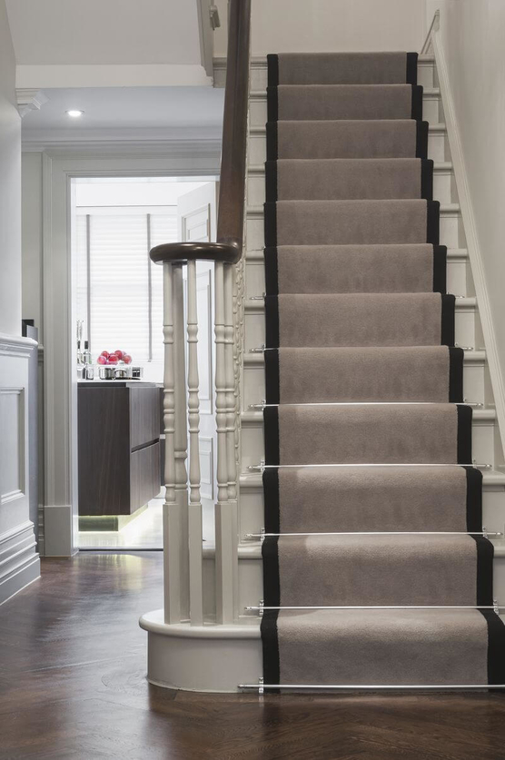
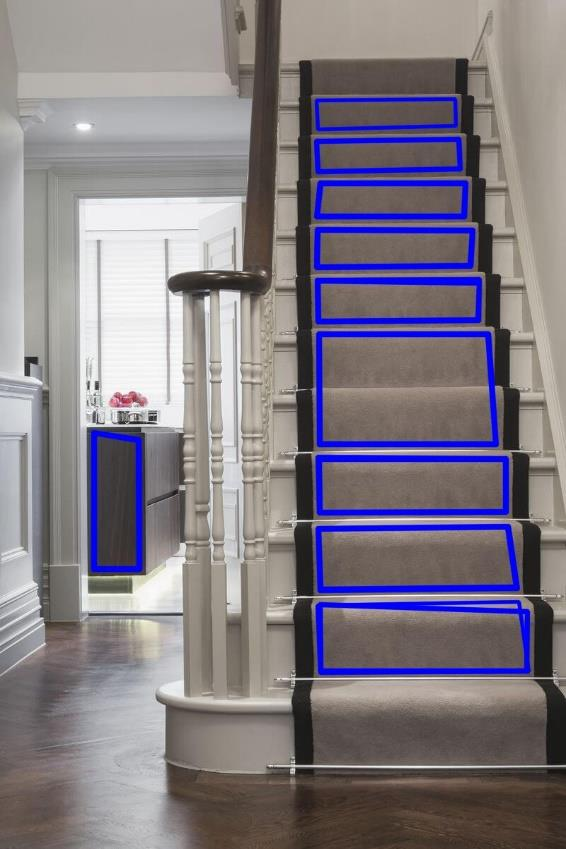

# Stairs_detector
## What This Project is About ?
This project contains code made in C++ that allows the detection stair steps using traditional image proccessing techniques.

## Type of Images Used
The images used for this poject have the following characteristics:
- The photo of the stairs is taken without angle,
- Stairs must be straight
- And finally, the stairs must have clear and well-defined edges.

### Here is an Example:

## Result Example

## Metrics
| Precision | Recall |
|-----------|--------|
| 0.78 | 0.64 |